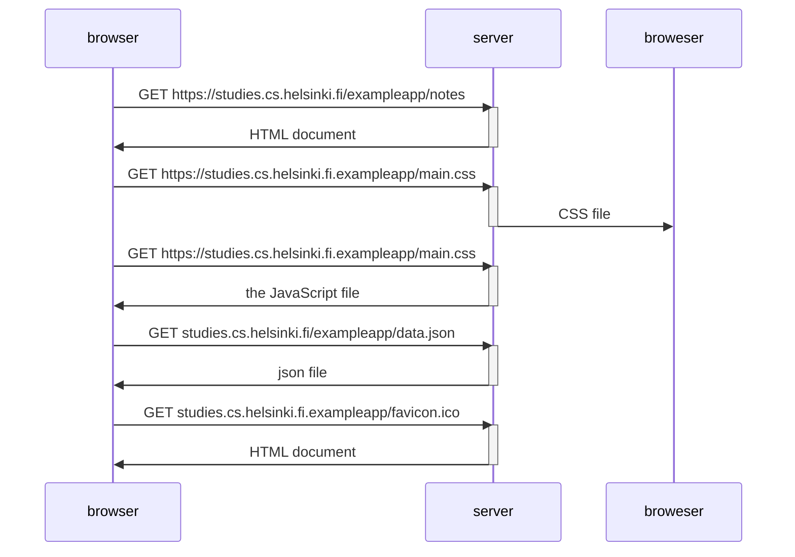

```mermaid
sequenceDiagram
participant browser
participant server
  browser->>server: GET https://studies.cs.helsinki.fi/exampleapp/notes
    activate server
    server->>browser: HTML document
    deactivate server
  browser->>server: GET https://studies.cs.helsinki.fi.exampleapp/main.css
    activate server
    server->>broweser: CSS file
    deactivate server
  browser->>server: GET https://studies.cs.helsinki.fi.exampleapp/main.css
    activate server
    server->>browser: the JavaScript file
    deactivate server
  browser->>server: GET studies.cs.helsinki.fi/exampleapp/data.json
    activate server
    server->>browser: json file
    deactivate server
  browser->>server: GET studies.cs.helsinki.fi.exampleapp/favicon.ico
    activate server
    server->>browser: HTML document
    deactivate server


```